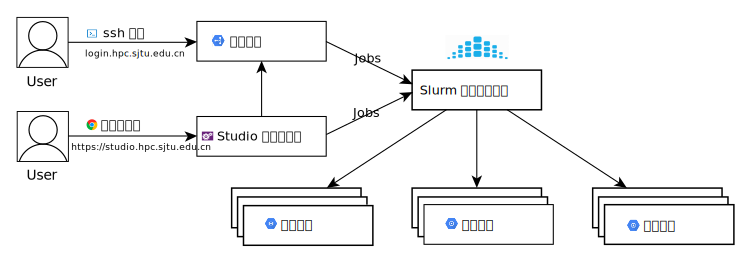

# <center>Slurm作业调度系统</center>

-------

[SLURM](http://slurm.schedmd.com/)（Simple Linux Utility for Resource Management）是一种可扩展的工作负载管理器，已被全世界的国家超级计算机中心广泛采用。 它是免费且开源的，根据[通用公共许可证](http://www.gnu.org/licenses/gpl.html)发行。

本文档将协助您通过SLURM管理作业。 在这里可以找到更多的工作样本。

如果我们可以提供任何帮助，请随时联系[hpc邮箱](mailto:hpc@sjtu.edu.cn)。



## Slurm概览

|  Slurm   | 功能  |
|  ----  | ----  |
| sinfo  | 集群状态 |
| squeue | 排队作业状态 |
| sbatch | 作业提交 | 
| scontrol | 查看和修改作业参数 |
| sacct | 已完成作业报告 | 
| sreport | 作业使用情况和群集使用情况报告 |
| scancel | 删除作业 | 

## `sinfo`：查看集群状态

| Slurm | 功能 |
| ---- | ---- |
| sinfo -N | 查看节点级信息 |
| sinfo -N --states=idle |  查看可用节点信息 |
| sinfo --partition=cpu | 查看队列信息 |
| sinfo --help | 查看所有选项 |

节点状态包括`drain`(节点故障)，`alloc`(节点在用)，`idle`(节点可用)，`down`(节点下线)， `mix`（节点被占用，但仍有剩余资源）。

集群设置以下队列，使用限制与说明如下

| 队列名 | 说明 |
| ---- | ---- |
| cpu | 允许单作业CPU核数为40~24000，每核配比4G内存，节点需独占使用；单节点配置为40核，192G内存 |
| huge | 允许单作业CPU核数为1~80，每核配比35G内存，节点可共享使用；单节点配置为80核，3T内存 |
| 192c6t | 允许单作业CPU核数为1~192，每核配比31G内存，节点可共享使用；单节点配置为192核，6T内存 |
| small | 允许单作业CPU核数为1~39，每核配比4G内存，节点可共享使用；单节点配置为40核，192G内存 |
| dgx2 | 允许单作业GPU卡数为1~128，推荐每卡配比CPU为6，每CPU配比15G内存；单节点配置为96核，1.45T内存，16块32G显存的V100卡 |

如果要查看总体资源信息：

```bash
$ sinfo
PARTITION AVAIL  TIMELIMIT  NODES  STATE NODELIST
cpu         up  30-00:00:0    656   idle cas[001-656]
dgx2        up  30-00:00:0      8   idle vol[01-08]
```

查看`cpu`队列状态:

```bash
$ sinfo -p cpu
PARTITION AVAIL  TIMELIMIT  NODES  STATE NODELIST
cpu*         up 30-00:00:0    656   idle cas[001-656]
```

查看节点级资源状态信息:

```bash
$ sinfo -N
cas001         1      cpu  idle  
cas002         1      cpu  idle  
cas003         1      cpu  idle  
...            .      ...  ...
cas654         1      cpu  idle 
cas655         1      cpu  idle 
cas656         1      cpu  idle
vol01          1      dgx2 idle
...            .      ...  ...
vol08          .      dgx2 idle  
```

## `squeue`：查看队列中的作业信息

| Slurm | 功能 |
| ---- | ---- |
| squeue -j jobid | 查看作业信息 |
| squeue -l | 查看细节信息 |
| squeue -n HOST | 查看特定节点作业信息 |
| squeue -A ACCOUNT_LIST | 查看ACCOUNT_LIST的作业 |
| squeue | 查看USER_LIST的作业 |
| squeue --state=R | 查看特定状态的作业 |
| squeue --start | 查看排队作业的估计开始时间 |
| squeue --format=“LAYOUT” | 使用给定的LAYOUT自定义输出 |
| squeue --help | 查看所有的选项 |

作业状态包括`R`(正在运行)，`PD`(正在排队)，`CG`(即将完成)，`CD`(已完成)。

默认情况下，`squeue`只会展示在排队或在运行的作业。

```bash
$ squeue
JOBID PARTITION     NAME     USER ST       TIME  NODES NODELIST(REASON)
18046      dgx2   ZXLing     eenl  R    1:35:53      1 vol04
17796      dgx2   python    eexdl  R 3-00:22:04      1 vol02
```

显示您自己账户下的作业：

```bash
squeue
JOBID PARTITION     NAME     USER ST       TIME  NODES NODELIST(REASON)
17923      dgx2     bash    hpcwj  R 1-12:59:05      1 vol05
```

`-l`选项可以显示更细节的信息。

```bash
squeue
JOBID PARTITION     NAME     USER    STATE       TIME TIME_LIMI  NODES NODELIST(REASON)
17923      dgx2     bash    hpcwj  RUNNING 1-13:00:53 30-00:00:00    1 vol05
```

## `SBATCH`：作业提交

准备作业脚本然后通过`sbatch`提交是Slurm的最常见用法。 为了将作业脚本提交给作业系统，SLURM使用

```bash
$ sbatch jobscript.slurm
```

Slurm具有丰富的参数集。 以下最常用的。

| Slurm | 含义 |
| ---- | ---- |
| -n [count] | 总进程数 |
| --ntasks-per-node=[count] | 每台节点上的进程数 |
| -p [partition] | 作业队列 |
| --job-name=[name] | 作业名 |
| --output=[file_name] | 标准输出文件 |
| --error=[file_name] | 标准错误文件 |
| --time=[dd-hh\:mm\:ss] | 作业最大运行时长 |
| --exclusive | 独占节点 |
| -mail-type=[type] | 通知类型，可选 all, fail, end，分别对应全通知、故障通知、结束通知 |
| --mail-user=[mail_address] | 通知邮箱 |
| --nodelist=[nodes] | 偏好的作业节点 |
| --exclude=[nodes] | 避免的作业节点 |
| --depend=[state:job_id] | 作业依赖 |
| --array=[array_spec] | 序列作业 |

这是一个名为`cpu.slurm`的作业脚本，该脚本向cpu队列申请1个节点40核，将walltime限制设置为10秒，并在作业完成时通知。在此作业中执行的命令是`/bin/hostname`。

```bash
#!/bin/bash

#SBATCH --job-name=hostname
#SBATCH --partition=cpu
#SBATCH -N 1
#SBATCH --mail-type=end
#SBATCH --mail-user=YOU@EMAIL.COM
#SBATCH --output=%j.out
#SBATCH --error=%j.err
#SBATCH --time=00:00:10
#SBATCH --exclusive

/bin/hostname
```

用以下方式提交作业：

```bash
sbatch cpu.slurm
```

`squeue`可用于检查作业状态。用户可以在作业执行期间通过SSH登录到计算节点。输出将实时更新到文件[jobid] .out和[jobid] .err。

这里展示一个更复杂的作业要求，其中将启动80个进程，每台主机40个进程。

```bash
#!/bin/bash

#SBATCH --job-name=LINPACK
#SBATCH --partition=cpu
#SBATCH -n 80
#SBATCH --ntasks-per-node=40
#SBATCH --mail-type=end
#SBATCH --mail-user=YOU@EMAIL.COM
#SBATCH --output=%j.out
#SBATCH --error=%j.err
#SBATCH --time=00:20:00
```

以下作业请求4张GPU卡，其中1个CPU进程管理1张GPU卡。
```bash
#!/bin/bash

#SBATCH --job-name=GPU_HPL
#SBATCH --partition=dgx2
#SBATCH -n 4
#SBATCH --ntasks-per-node=4
#SBATCH --gres=gpu:4
#SBATCH --mail-type=end
#SBATCH --mail-user=YOU@MAIL.COM
#SBATCH --output=%j.out
#SBATCH --error=%j.err
#SBATCH --time=00:30:00
```

以下作业启动一个3任务序列（从0到2），每个任务需要1个CPU内核。关于Pi上的Python，您可以查阅我们的[Python文档](https://docs.hpc.sjtu.edu.cn/application/Python/)。

```bash
#!/bin/bash

#SBATCH --job-name=python_array
#SBATCH --mail-user=YOU@MAIL.COM
#SBATCH --mail-type=ALL
#SBATCH --ntasks=1
#SBATCH --time=00:30:00
#SBATCH --array=0-2
#SBATCH --output=python_array_%A_%a.out
#SBATCH --output=python_array_%A_%a.err

module purge
module load miniconda2/4.6.14-gcc-4.8.5

source activate YOUR_ENV_NAME

echo "SLURM_JOBID: " $SLURM_JOBID
echo "SLURM_ARRAY_TASK_ID: " $SLURM_ARRAY_TASK_ID
echo "SLURM_ARRAY_JOB_ID: " $SLURM_ARRAY_JOB_ID

python < vec_${SLURM_ARRAY_TASK_ID}.py
```

## `srun` and `salloc`: 提交交互式作业

`srun`可以启动交互式作业。该操作将阻塞，直到完成或终止。例如，在计算主机上运行`hostname`。

```bash
$ srun -N1 -n1  hostname
cas006
```

启动远程主机bash终端。

```bash
 srun -p cpu -n 1 --exclusive --pty /bin/bash
hostname
cas005
free
              total        used        free      shared  buff/cache   available
Mem:      196466436     2650052   190927408      198180     2888976   191763544
Swap:      33554428           0    33554428
```

或者，可以通过`salloc`请求资源，然后在获取节点后登录到计算节点。

```bash
salloc -N1 -n1 --exclusive
squeue -u `whoami` --state=running
ssh casxxx
```

`scontrol`: 查看和修改作业参数

| Slurm | 功能 |
| ---- | ---- |
| scontrol show job JOB_ID | 查看排队或正在运行的作业的信息 |
| scontrol -dd show job JOB_ID | 查看批处理作业脚本 | 
| scontrol hold JOB_ID | 暂停JOB_ID |
| scontrol release JOB_ID | 恢复JOB_ID | 
| scontrol update JobID=JOB_ID Timelimit=1-12:00:00 | 将工作时间更改为1天12小时(仅适用于未完成的作业) |
| scontrol update dependency=JOB_ID | 添加作业依赖性，以便仅在JOB_ID完成后才开始作业 | 
| scontrol --help | 查看所有选项 |

`sacct`: 查看本账号作业信息

| Slurm | 功能 |
| ---- | ---- |
| sacct -l | 查看详细的帐户作业信息 |
| sacct -A ACCOUNT_LIST | 查看ACCOUNT_ID的账号作业信息 |
| sacct -u USER_NAME | 查看USER_NAME的账号作业信息 |
| sacct --allusers | 查看所有用户的工作账号作业信息 |
| sacct --states=R | 查看具有特定状态的作业的账号作业信息 |
| sacct -S YYYY-MM-DD | 在指定时间后选择处于任意状态的作业 |
| sacct --format="LAYOUT" | 使用给定的LAYOUT自定义sacct输出 |
| sacct --help | 查看所有选项 |

默认情况下，sacct显示过去 **24小时** 的账号作业信息。

```bash
$ sacct
```

查看更多的信息：

```bash
$ sacct --format=jobid,jobname,account,partition,ntasks,alloccpus,elapsed,state,exitcode -j 3224
```

查看平均作业内存消耗和最大内存消耗：

```bash
$ sacct --format="JobId,AveRSS,MaxRSS" -P -j xxx
```

## `sreport`: 生成集群或作业信息

| Slurm | 功能 |
| ---- | ---- |
| sreport cluster utilization | 查看集群利用率报告 |
| sreport user top | 根据过去24小时的总CPU时间显示排名前10位的集群用户 | 
| sreport cluster AccountUtilizationByUser start=2019-11-01 | 显示自2019年11月1日起每位用户的帐户使用情况。|
| sreport job sizesbyaccount PrintJobCount | 显示按组运行的作业数 | 
| sreport --help | 显示所有选项 |

默认情况下，`sreport`使用过去24小时的统计信息。

## Slurm环境变量

| Slurm | 功能 |
| ---- | ---- |
| $SLURM_JOB_ID | 作业ID |
| $SLURM_JOB_NAME | 作业名|
| $SLURM_JOB_PARTITION | 队列的名称 |
| $SLURM_NTASKS | 进程总数 |
| $SLURM_NTASKS_PER_NODE | 每个节点请求的任务数 |
| $SLURM_JOB_NUM_NODES | 节点数 | 
| $SLURM_JOB_NODELIST | 节点列表 | 
| $SLURM_LOCALID | 作业中流程的节点本地任务ID | 
| $SLURM_ARRAY_TASK_ID | 作业序列中的任务ID |
| $SLURM_SUBMIT_DIR | 工作目录 |
| $SLURM_SUBMIT_HOST | 提交作业的主机名 |

## 参考链接

 - [SLURM Workload Manager](http://slurm.schedmd.com)
 - [ACCRE’s SLURM Documentation](http://www.accre.vanderbilt.edu/?page_id=2154)
 - [Introduction to SLURM (NCCS lunchtime series)](http://www.nccs.nasa.gov/images/intro-to-slurm-20131218.pdf)
 - [Slides for the HPC Seminar on Jan 7th, 2016: Use SLURM on SJTU Pi Supercomputer](http://pi.sjtu.edu.cn/slides/slurm_20160107.pdf)
