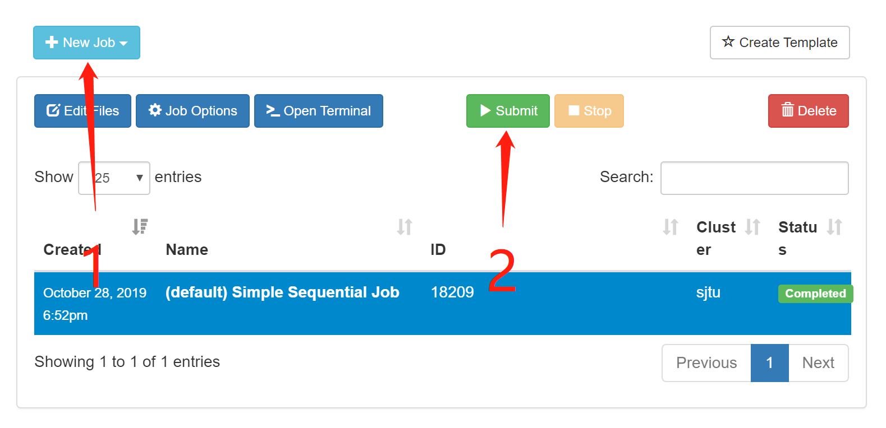
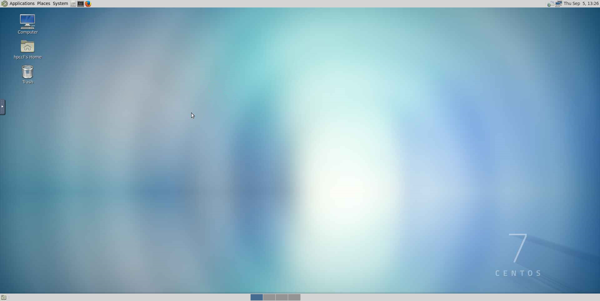
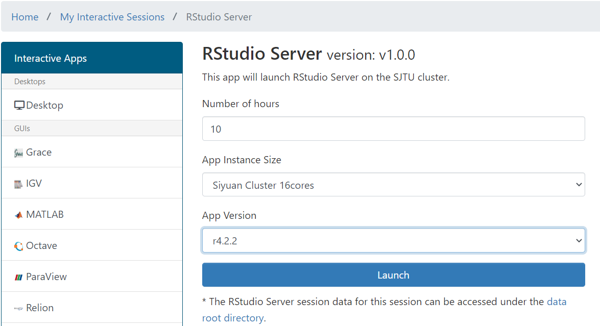
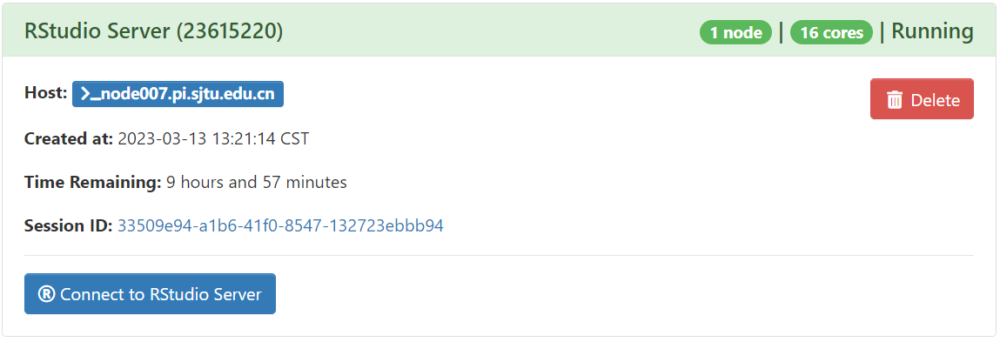
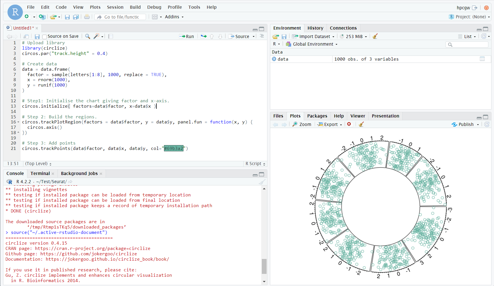

# 
HPC Studio：图形化操作与远程桌面

--------

## 登陆

在浏览器中，打开：https://studio.hpc.sjtu.edu.cn

!!! tip
    浏览器需为chrome，火狐，edge

## 文件管理

点击图标Files下拉菜单Home Directory即可进入文件管理界面

文件管理包含以下功能：

| 功能 | 详细功能 | 按钮 |
| ---- | ---- | ---- |
| 查看 | 点击文件可查看文件内容，点击文件夹可显示文件属性 | 1 |
| 编辑 | 仅可编辑文本文件，编辑文件有多种编辑器可选，均为系统嵌入，无需链接本地编辑器 | 2 |
| 重命名/移动 | 重命名或移动文件 | 3 |
| 下载 | 下载文件，若下载的为文件夹则会自动压缩成压缩包进行下载 | 4 |
| 拷贝/粘贴 | 复制文件 | 5 6 |
| 全选/取消全选| 选择文件功能 | 7 |
| 进入··· | 进入到其他路径 | 8 |
| 打开终端 | 打开webshell | 9 |
| 新建文件 | 新建文件 | 10 |
| 新建目录 | 新建目录 | 11 |
| 上传 | 上传文件 | 12 |
| 显示隐藏文件 | 点击可显示隐藏文件/文件夹 | 13 |
| 显示属主信息 | 显示文件/文件夹属主/大小/日期等信息 | 14 |
| 删除 | 删除文件/文件夹 | 15 |

## 作业

### 查看作业

点击`Jobs->Active Jobs`，查看队列中的作业。在右上角的`Your Jobs/All Jobs`中选择要查看的任务类型。

点击作业项前的箭头查看作业详情。

### 提交作业

点击`Jobs->Job Composer`，打开新建作业选项卡。

点击左上角`New Job`（1）按钮，选择模板，点击`submit`（2）按钮提交作业。

同时HPC Studio提供了在线文本编辑功能，在右侧底部的`Submit Script`选项卡中，点击`Open Editor`按钮，即可打开文本编辑器。

## 在线Shell终端

点击`Clusters->sjtu Shell Access`,打开在线终端。

## 远程桌面

远程桌面打开方式需先提交一个空的作业取得计算节点的控制权（此操作会计入机时）。

点击`Interactive Apps->Desktop`按钮，进入作业提交页面。

填写账号信息`Account`及队列`Patition`。然后点击`launch`即可进入桌面选项卡。

!!! tips
    `Account`为各用户的主账号而非登录的用户名，格式为acct-xxxxxx
    `Number of hours`为设置远程卓业桌面使用的时间，作业一旦节点，远程桌面的session即会失效
    `Number of nodes`为节点数量，请设置为1，以免浪费您的机时
    `Patition`为队列

待选项卡显示作业在running的状态时,点击`launch`即可进入远程桌面。

## RStudio使用说明
登录HPC Studio平台后，在内置应用中选择RStudio Server，如下图

点击后会出现下图的选项卡，里面定义好了所需的选项卡，可以自定义时间，该时间为作业时间，时间自行定义。设置完成后launch即可完成提交。

待选项卡从等待变成Running后，如下图所示，可使用Connect to RStudio Server打开Rstudio平台进行开发。

该RStduio Server提供了基本与本地的desktop版本相同的功能，所需的R依赖包自行下载

